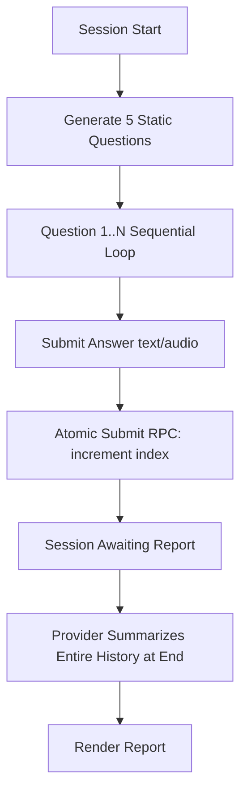
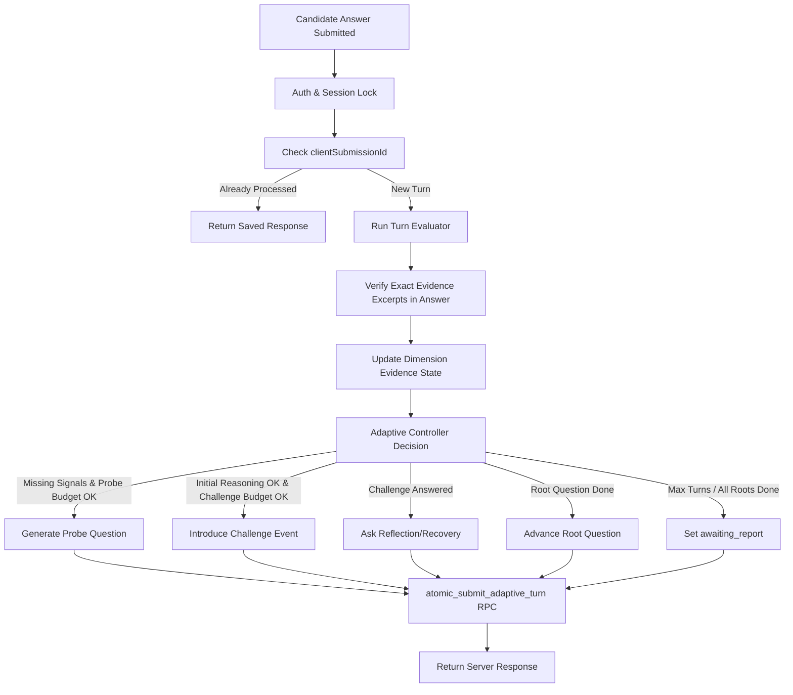

# P0-2: Future-Ready Interview Session Engine — Implementation Plan

## Problem Statement & Executive Summary

MockMate Interview is evolving from a sequential question-and-answer format into a future-ready reasoning-training engine. Traditional interview tools focus heavily on memorized answer patterns or syntax recall. In contrast, MockMate trains and evaluates candidates on core reasoning capabilities: clarifying ambiguous problems, stating assumptions, evaluating trade-offs, making defensible choices under uncertainty, and responding constructively to interviewer pushback or shifting constraints.

This plan details the design of the **Adaptive Interview Session Engine (v2)**, including:
1. Server-authoritative adaptive state machine with bounded turn budgets and explicit stage progression.
2. Versioned mode-policy matrix for all nine reasoning modes.
3. Strict, evidence-grounded turn evaluator (`mockmate_turn_evaluator_v1`) enforcing exact candidate text excerpts.
4. Challenge-event model for testing candidate resilience and position updating.
5. Forward-only PostgreSQL migration and service-role-only idempotent RPC (`atomic_submit_adaptive_turn`).
6. Deterministic evidence aggregation scorecard (eliminating provider-invented overall scores).
7. Comprehensive test suite spanning shared contracts, controller logic, route integration, PostgreSQL runtime verification, and Playwright end-to-end user journeys.

---

## 1. Current Interview Flow



### Limitations of Current Flow:
- Fixed turn count (`totalQuestions` directly equals turn count).
- No follow-up probing when candidate reasoning is incomplete or ambiguous.
- No challenge events or constraint changes during the session.
- Turn evaluations are not persisted per-turn; report generation calls the LLM over the full transcript at the end, leading to potential hallucination of candidate evidence or invented scores.

---

## 2. Current Server State Model

The existing `interview_sessions` table tracks:
- `current_question_index` (integer)
- `pending_question_id` (text)
- `pending_question` (jsonb)
- `status` ('active' | 'awaiting_report' | 'completed')
- `evaluation_status` ('not_tested' | 'processing' | 'completed' | 'failed')

The existing `atomic_submit_answer` RPC locks the session, inserts a turn row, updates `current_question_index = current_question_index + 1`, and sets `status = 'awaiting_report'` when `current_question_index == totalQuestions`.

---

## 3. Current Report-Generation Model

Currently, `generateFinalReport` receives the full turn history, constructs a raw transcript prompt, calls Gemini/Groq, and attempts to extract a JSON report containing `dimension_scores`, `readiness`, and `simplifiedScore`.

### Disadvantages:
- Scores are not grounded in per-turn verified evidence.
- Untested dimensions can receive arbitrary LLM scores.
- Provider can return hire/no-hire recommendations (violating training positioning).

---

## 4. Proposed Adaptive State Machine



### State Variables:
- `totalQuestions`: Number of planned **root** scenarios (e.g. 3–5).
- `maxTurns`: Safe maximum total candidate turns (e.g. 8, max cap 12).
- `currentRootQuestionIndex`: Pointer to active root blueprint (0 to totalQuestions - 1).
- `currentTurnIndex`: Total candidate turns submitted so far.
- `probeCountForRoot`: Number of probes issued for the current root question (max 1–2).
- `challengeCount`: Total challenge events issued in the session (max 2–3).
- `currentStage`: Active interview stage (`opening`, `clarification`, `framing`, `exploration`, `decision`, `challenge`, `reflection`).
- `sessionVersion`: Monotonically increasing counter incremented on every committed turn.

---

## 5. Mode-Policy Matrix (`mockmate_adaptive_controller_v1`)

| Reasoning Mode | Primary Dimensions | Stage Progression | Allowed Challenges | Max Probes/Root | Max Challenges |
| :--- | :--- | :--- | :--- | :---: | :---: |
| `classic_behavioral` | NARRATIVE_COHERENCE, STAKEHOLDER_FLUENCY, DECISION_QUALITY, INTELLECTUAL_HONESTY | framing → exploration → decision → reflection | stakeholder_pushback, evidence_request | 1 | 2 |
| `classic_technical` | PROBLEM_FRAMING, SYSTEMS_THINKING, TRADEOFF_CLARITY, DECISION_QUALITY, UNCERTAINTY_HANDLING | clarification → framing → exploration → decision → reflection | scale_change, constraint_change, risk_tradeoff | 2 | 2 |
| `narrative_reasoning` | NARRATIVE_COHERENCE, INTELLECTUAL_HONESTY, STAKEHOLDER_FLUENCY, DECISION_QUALITY | framing → exploration → decision → reflection | counterargument, evidence_request | 1 | 2 |
| `problem_framing` | PROBLEM_FRAMING, SYSTEMS_THINKING, UNCERTAINTY_HANDLING, DECISION_QUALITY | clarification → framing → exploration → decision → reflection | assumption_challenge, constraint_change | 2 | 2 |
| `tradeoff_decision` | TRADEOFF_CLARITY, DECISION_QUALITY, SYSTEMS_THINKING, UNCERTAINTY_HANDLING | framing → exploration → decision → challenge → reflection | constraint_change, risk_tradeoff, scale_change | 1 | 3 |
| `stakeholder_pressure` | STAKEHOLDER_FLUENCY, DECISION_QUALITY, RECOVERY_QUALITY, INTELLECTUAL_HONESTY | framing → decision → challenge → reflection | stakeholder_pushback, counterargument | 1 | 3 |
| `ai_collaboration_review` | AI_COLLABORATION, INTELLECTUAL_HONESTY, UNCERTAINTY_HANDLING, DECISION_QUALITY, SYSTEMS_THINKING | clarification → framing → exploration → challenge → reflection | ai_output_critique, risk_tradeoff, evidence_request | 2 | 2 |
| `uncertainty_handling` | UNCERTAINTY_HANDLING, INTELLECTUAL_HONESTY, PROBLEM_FRAMING, DECISION_QUALITY | clarification → framing → exploration → decision → reflection | constraint_change, evidence_request | 2 | 2 |
| `adversarial_pushback` | RECOVERY_QUALITY, INTELLECTUAL_HONESTY, NARRATIVE_COHERENCE, DECISION_QUALITY | framing → decision → challenge → reflection | counterargument, stakeholder_pushback | 1 | 3 |

---

## 6. Turn-Evaluation Contract (`mockmate_turn_evaluator_v1`)

### Schema Structure (`TurnEvaluation`):
- `evaluationStatus`: `'evaluated' | 'insufficient_evidence' | 'unavailable'`
- `answerSummary`: string | null (neutral description, no evaluative claims when unavailable)
- `observations`: `DimensionObservation[]`
  - `dimension`: `DimensionKey`
  - `anchorScore`: `0 | 1 | 2 | 3 | 4 | null`
  - `confidence`: `'low' | 'medium' | 'high'`
  - `evidenceExcerpt`: string | null
  - `signal`: string
  - `rationale`: string
  - `stage`: `InterviewStage`
  - `turnKind`: `QuestionKind`
- `missingSignals`: string[]
- `contradictions`: string[] (optional)
- `recommendedProbe`: string | null
- `providerMetadata`: `ProviderMetadata` (optional)

---

## 7. Evidence-Integrity Rules

1. **Exact Candidate Evidence Substring**: Every observation with an `anchorScore` (0–4) must reference an `evidenceExcerpt`.
2. **Server Verification**: The server normalizes whitespace and verifies that `evidenceExcerpt` is an exact substring of candidate answer text (`candidateResponse`).
3. **Automatic Demotion**: If `evidenceExcerpt` cannot be verified in candidate answer text, the server demotes `anchorScore` to `null` and sets `score_status` to `'insufficient_evidence'`.
4. **No Synthesized Quotations**: LLM-invented quotes are strictly rejected.
5. **No Interviewer Text as Candidate Evidence**: Quotes matching the question or prompt are discarded.
6. **Skipped Answers / Audio Unavailable**: Marked `evaluationStatus = 'insufficient_evidence'` or `'unavailable'` with zero recorded dimension scores.
7. **No Proxies**: Answer length, grammar, or speech fluency must not be used to score reasoning quality.
8. **Inactive Dimensions**: Non-active dimensions for the selected reasoning mode are marked `'not_tested'`.

---

## 8. Challenge-Event Model

A `ChallengeEvent` represents an explicit, auditable interruption or counter-perspective introduced during an interview session.

```typescript
export interface ChallengeEvent {
  id: string;
  type: ChallengeEventType;
  prompt: string;
  rationale: string;
  targetDimensions: DimensionKey[];
  triggeringTurnId: string;
  triggeringEvidence: string;
  stage: InterviewStage;
  severity: 'low' | 'medium' | 'high';
}
```

### Challenge Event Types:
- `assumption_challenge`: Directly questions a core assumption made by the candidate.
- `evidence_request`: Asks for concrete empirical verification or testing strategy.
- `constraint_change`: Alters budget, timeline, latency, or compliance requirements.
- `stakeholder_pushback`: Simulates executive or client resistance.
- `scale_change`: Increases load or data volume by 100x.
- `risk_tradeoff`: Forces explicit selection between speed and safety.
- `ai_output_critique`: Introduces flawed AI code or recommendation for candidate review.
- `counterargument`: Presents a strong competing technical/business path.

---

## 9. Database Migration (`20260723_add_adaptive_interview_engine.sql`)

### Modifications to `interview_sessions`:
- `engine_version` (text DEFAULT 'v2')
- `session_version` (integer DEFAULT 1)
- `current_root_question_index` (integer DEFAULT 0)
- `current_turn_index` (integer DEFAULT 0)
- `current_stage` (text DEFAULT 'opening')
- `pending_question_kind` (text DEFAULT 'root')
- `active_root_question_id` (text)
- `probe_count_for_root` (integer DEFAULT 0)
- `challenge_count` (integer DEFAULT 0)
- `adaptive_policy` (jsonb)
- `dimension_state` (jsonb DEFAULT '{}'::jsonb)
- `last_controller_decision` (jsonb)

### Modifications to `interview_turns`:
- `client_submission_id` (uuid)
- `question_blueprint` (jsonb)
- `question_kind` (text DEFAULT 'root')
- `root_question_id` (text)
- `stage` (text DEFAULT 'framing')
- `answer_kind` (text DEFAULT 'answered')
- `evaluation_status` (text DEFAULT 'not_tested')
- `turn_evaluation` (jsonb)
- `controller_decision` (jsonb)
- `challenge_event` (jsonb)
- `engine_version` (text DEFAULT 'v2')

### Idempotency Index:
```sql
CREATE UNIQUE INDEX IF NOT EXISTS idx_interview_turns_session_client_sub
ON public.interview_turns (session_id, client_submission_id)
WHERE client_submission_id IS NOT NULL;
```

---

## 10. Atomic Commit Design (`atomic_submit_adaptive_turn` RPC)

Service-role-only PostgreSQL RPC that atomically:
1. Acquires row lock (`FOR UPDATE`) on `interview_sessions` for `p_session_id` & `p_user_id`.
2. Checks if `p_client_submission_id` already exists in `interview_turns`. If so, returns the previously committed response payload idempotently.
3. Checks state validity: session must be `active`, `pending_question_id` must match `p_question_id`, `session_version` must match `p_expected_session_version`.
4. Inserts turn into `interview_turns`.
5. Updates session state, counters (`session_version = session_version + 1`, `current_turn_index = current_turn_index + 1`), stage, `dimension_state`, and sets `pending_question`.
6. Sets `status = 'awaiting_report'` if controller decision is `complete_session`.
7. Returns canonical `AdaptiveAnswerSubmissionResponse`.

---

## 11. Browser Impact

- **Session Prep**: Exposes 9 reasoning modes with descriptions and adaptive policy controls (`maxTurns`, delivery mode).
- **Session Header**: Displays root scenario progress, turn progress, active stage, and reasoning mode badge.
- **Question View**: Differentiates question kinds (`root`, `probe`, `challenge`, `reflection`) with dedicated UI tags and rendered challenge banners for challenge events.
- **Coach vs Exam Mode**: Coach mode displays immediate non-numeric guidance (strength observed & next focus) without revealing numeric scores. Exam mode hides all feedback until final report.
- **Report View**: Shows evidence-backed dimension score cards, challenge/recovery trajectory timeline, and links every candidate quote to its turn.

---

## 12. Report Impact

- Reports are derived from **persisted turn evaluations** aggregated deterministically via `evidenceAggregationService`.
- A dimension is scored only if supported by evidence from at least **2 distinct turns** OR an initial observation + a challenge/recovery observation. Otherwise marked `insufficient_evidence`.
- Overall `simplifiedScore` is calculated only when at least 3 active dimensions are scored and 60%+ of active dimensions have sufficient evidence. Otherwise `simplifiedScore = null`, `readiness = NOT_ASSESSED`.
- All hire/no-hire recommendations are eliminated; language focuses exclusively on practice readiness and skill growth.

---

## 13. Compatibility Plan

- Existing P0-1 session objects are normalized automatically via `normalizeQuestionBlueprint` and `normalizeSessionState`.
- Old standard `atomic_submit_answer` RPC remains untouched and active in PostgreSQL schema.
- The new engine uses `atomic_submit_adaptive_turn` for version 2 sessions.

---

## 14. Test Strategy

1. **Shared Contracts Tests**: Schema validation for `AdaptivePolicy`, `QuestionBlueprint`, `ChallengeEvent`, `TurnEvaluation`, `AdaptiveSessionState`.
2. **Mode Policy Tests**: Verify all 9 reasoning modes define valid active dimensions, stage sequences, and challenge allowances.
3. **Turn Evaluator Tests**: Test exact evidence substring matching, demotion on mismatch, rejection of interviewer text quotes, and handling of provider failure.
4. **Adaptive Controller Tests**: Test decision logic order, probe limits, challenge limits, max turn caps, skipped answer handling, and loop prevention.
5. **PostgreSQL Runtime Verification**: Disposable Postgres script (`verify-supabase-runtime.mjs`) testing migration execution, RPC locking, idempotency retries, session versioning, and service-role permission bounds.
6. **Backend Route Tests**: Integration testing for `/api/interview/sessions/:sessionId/answers` with network retries, coach vs exam behavior, evidence validation, and report generation.
7. **Playwright E2E Journey**: End-to-end browser test completing a multi-turn adaptive interview session with probes, challenge events, and final evidence-backed report.

---

## 15. Rollback Approach

- The migration is strictly additive and non-destructive.
- The P0-1 engine and `atomic_submit_answer` RPC remain intact and unmodified.
- If necessary, session creation can default back to engine version `v1`.

---

## 16. Explicit Non-Goals

- Career Context Graph or Resume-to-Interview grounding redesign.
- Native mobile adaptive Interview screen (remains safely disabled with build notice).
- Automated hiring decisions or hire/no-hire recommendations.
- Live proctoring, facial/emotion recognition, or surveillance features.
- Live Supabase deployment or hosted migration runs.
